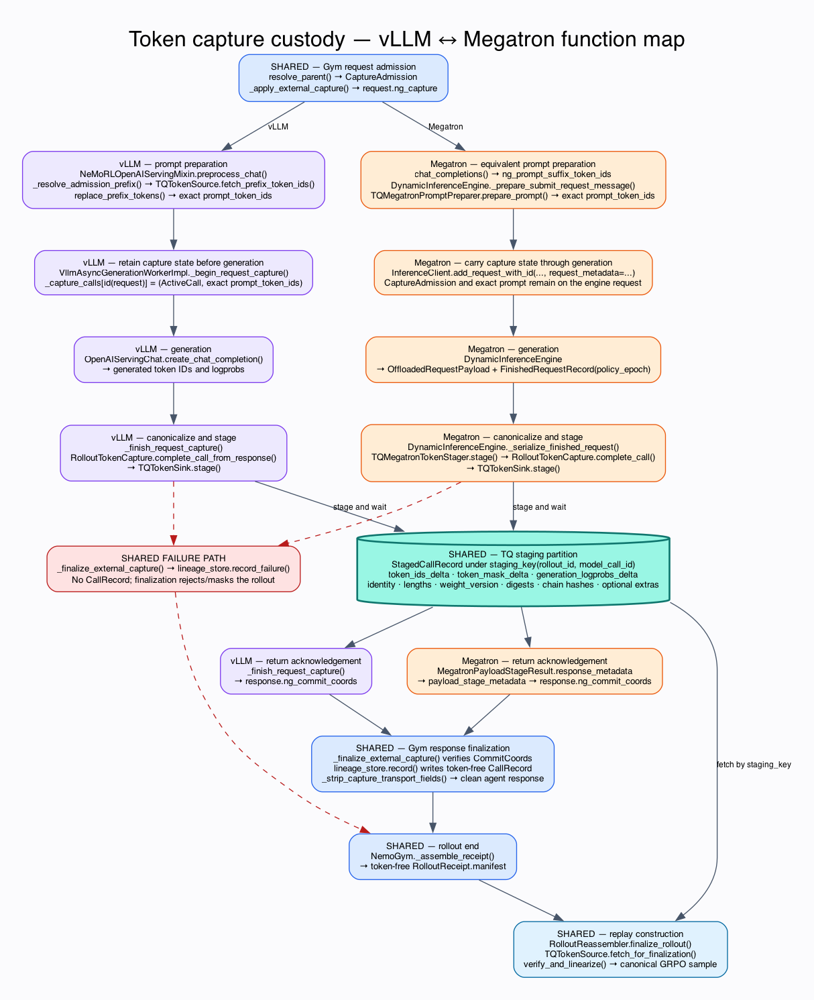

# Token Capture Lineage Ledger

Exact-token capture for blackbox agentic rollouts is coordinated by a single
per-rollout **capture ledger**: NeMo Gym's `LineageStore`, extended so that its
append-only JSONL rows are simultaneously the request-time lineage index and
the token-free record of rollout capture state. There is no separate gate
state machine; serving workers coordinate only through the ledger, and NeMo RL
(the rollout owner) assembles the `RolloutReceipt` itself at rollout end.

The external staging contract (`StagingSink` / `StagingSource`), the vLLM
worker capture path, and the `verify_and_linearize()` trust boundary are
unchanged from the worker-custody design.

## Why a ledger and not a gate

An earlier iteration paired the lineage store with a `RolloutCaptureGate` and
a cross-process `GateStateStore`. The gate did not provide a second lineage
algorithm — parent resolution ran upstream through `LineageStore.resolve()`,
and the gate cross-checked that result against its own copy of the call state,
storing each call's cumulative token IDs **twice** (gate state + lineage
JSONL). Its file-backed state store also serialized the entire global gate
state — every live rollout's cumulative token arrays — under one exclusive
lock, three transactions per model call.

Everything the gate legitimately provided — admission, rollout completeness,
terminal selection, cleanup — is either a pure function of the lineage result
or belongs to the framework that already owns the rollout. So each
responsibility moved to its natural owner and the redundant state machine was
deleted.

## The ledger

`FileLineageStore` writes one locked, fsynced JSONL row per committed call.
In external-staging mode (`token_id_capture.external_staging: true`) each row
additionally carries the token-free `CallRecord` custody columns —
`parent_call_id`, `staging_key`, `weight_version`, `prev_len` / `delta_len` /
`cum_len`, the staged record's `digest` and `extras_digest`, `mode`, the
served `response_id` (the envelope id the agent received; terminal
attribution's join key), `admitted_at`, and the call's content fingerprints.
Four surfaces make it the single record of capture state (the
`CaptureLedger` protocol):

- `record(...)` — the extended commit row, written by the model server's
  commit hook after the worker's `CommitCoords` arrive.
- `record_failure(rollout_id, model_call_id, reason)` — a poison row for a
  call whose capture did not commit. Failure rows carry no fingerprint, so
  `resolve()` can never return them as parents.
- `manifest(rollout_id)` — the token-free read-back (committed rows +
  failures), exposed over one bearer-protected control route:
  `GET /training-token-capture/control/rollouts/{rollout_id}/manifest`.
- `has_rows(rollout_id)` — whether any ledger row (committed or failed)
  exists for the rollout; this is how admission tells a seeded assistant
  history (no rows) from a broken chain.

`InMemoryLineageStore` cannot serve the ledger role: its resolution index
evicts rollouts under memory bounds, which is fine for a cache but not for a
completeness record. External staging requires a non-evicting store and
rejects the in-memory store at startup.

## Admission is a pure function

When external staging is enabled, `resolve_parent()` builds the
`CaptureAdmission` directly from the lineage result — a strict tri-state:

| Lineage outcome | Admission |
| --- | --- |
| `ROOT` — empty assistant fingerprint, or unmatched fingerprint on a rollout with no ledger rows (seeded assistant history) | `text` mode, no parent |
| `MATCH` — unique fingerprint match with verified context digest | `token_in` mode, the parent's ordered `staging_chain`, cumulative length, and chain hash |
| `UNRESOLVED` — non-empty fingerprint with no match, ambiguity, or digest mismatch | no admission; `record_failure()` poisons the call |

`UNRESOLVED` is never silently converted into a new root: doing so would turn
earlier policy-generated tokens into mask-zero prompt tokens and corrupt the
training row. The completion still serves the agent; only training capture is
poisoned.

## Commit ordering

The invariant the external sink requires — *a call must not become a lineage
parent until its staged record is durable* — holds structurally: the worker
stages through `StagingSink.stage()` before acknowledging, coordinates exist
only after the bytes are durable, and the ledger row (which is what makes a
call resolvable as a parent) is written only after the coordinates arrive.
On `disposition == "staged"` the commit hook appends the token-free coordinates
and lineage witnesses to the ledger. On `capture_failed`, missing coordinates,
or any acknowledgement error it appends a failure row instead. A request that
dies after admission is poisoned from the capture middleware's `finally` hook.

### Megatron Inference payload staging

MInf now uses the same canonical durability boundary through two generic engine
hooks. These hooks (`DynamicInferenceEngine.payload_stager` /
`prompt_preparer`, the `RequestPayloadStager` protocol, and the rendered
prior-turn tokens plus EOS id carried as request metadata) come from
[NVIDIA/Megatron-LM PR #7015](https://github.com/NVIDIA/Megatron-LM/pull/7015)
and are not yet in the Megatron-LM pinned through Megatron-Bridge; setup fails
with a `NotImplementedError` naming that dependency until the pin is bumped.

Gym's complete `CaptureAdmission` travels as opaque request metadata.
Before engine admission, the model-parallel coordinator resolves an admitted
`staging_chain` through `TQTokenSource`, splices the exact parent tokens into
the rendered prompt with the same `replace_prefix_tokens` the vLLM worker uses,
and broadcasts that prepared request to every rank. When
generation completes, the coordinator passes that admission, the exact
`OffloadedRequestPayload`, and the finished request's policy epoch to
`TQMegatronTokenStager`. A request that straddles a refit carries more than
one `policy_epoch` boundary; the stager stamps the admission epoch — the
first `policy_epoch` boundary — matching vLLM's `begin_call` semantics, and
counts the span on `epoch_span_count` (logged at WARNING) rather than masking
the rollout.

The stager invokes Gym's engine-neutral `RolloutTokenCapture`, which constructs
the canonical delta and writes it through the same `TQTokenSink` used by vLLM.
Only after that write returns does MInf attach `ng_commit_coords` to the HTTP
response. Gym consequently commits an ordinary token-free `CallRecord` before
the response is released to the agent. No local metadata ledger or rollout-end
conversion is involved in the active path.

### Multimodal rollouts (Megatron Inference only)

A vision-language engine has two token spaces. The chat endpoint tokenizes the
render in *compact* form (one media token per image or video); the engine
expands every media token into one token per projected embedding and runs on
the *expanded* form. The trainer needs the expanded ids (they align with the
projected features); the next turn's chat render can only be spliced against
the compact ids, because the engine expands whatever it is handed and would
otherwise expand the previous turn twice and reject the request on its
placeholder count.

Capture therefore stages both spaces and the media geometry inside the digest,
and the media tensors themselves as extra, digest-external columns on the same
call row:

- MInf's `OffloadedRequestPayload` carries `compact_prompt_token_ids` and
  `media_tensors` (the vision-encoder inputs: packed patches `imgs`,
  `imgs_sizes`, `num_frames` / `num_tiles`). RL derives a small media geometry
  from those tensors (`tq_token_sink.media_geometry`), and Gym's
  `MegatronCaptureAdapter` stages the compact delta and that geometry as
  `StagedCallRecord.extras` (`nemo_gym.token_id_capture.staging.media`), so both
  are bound by `extras_digest`. `TQTokenSink` pops the compact delta into its
  own column (`compact_token_ids_delta` / `compact_len`, like `routed_experts`)
  and keeps the geometry in the extras JSON. These payload fields come from
  tdene/Megatron-LM#20 (on top of NVIDIA/Megatron-LM#7015) and the media extras
  from Gym's `staging/media.py` (lauradang/Gym#1 on top of
  NVIDIA-NeMo/Gym#2823); neither is in the pinned submodules yet, so this path
  requires both re-pins.
- `TQMegatronPromptPreparer` resolves a `staging_chain` in both spaces
  (`TQTokenSource.fetch_prefix_chains`), splices the *compact* chain into the
  render, hands Gym the *expanded* chain as `required_prefix_token_ids`, and
  records the compact chain length in `offload_params["ng_capture_minf"]` so
  the stager can cut the call's compact delta. Gym's existing prefix check on
  the engine's expanded prompt then verifies that re-expanding the same media
  reproduced the same tokens; drift poisons the call.
- The media tensors themselves ride the call row: `TQMegatronTokenStager`
  writes `media_tensors` as extra columns on the call row
  (`MEDIA_STAGING_FIELDS`), in the same put as the token columns: the stager
  parks the tensors on the sink before Gym stages the record, so a call is
  staged whole or not at all. Routed experts ride the row the same way. Like the token
  columns they are per-call deltas: every chat request carries the whole
  conversation, so the engine hands over pixels for every image in the prompt,
  and the stager drops the items the parent chain already staged
  (`media_prev_count`, recorded by the preparer next to `compact_prev_len` from
  the parent rows' geometry; `slice_media_tensors`). They are outside Gym's
  digest; the digest-covered geometry names what each row holds. Receipts stay
  token-free and no new key exists: cleanup of the call rows clears the media.
- `RolloutReassembler.finalize_rollout` walks the terminal chain: for each
  call whose staged geometry names media it reads that row's media columns,
  requires the staged `imgs_sizes` / `num_frames` / `num_tiles` to equal the
  geometry, and rejects the rollout otherwise (`media_columns_missing`,
  `media_mismatch`, `invalid_media_columns`). The per-call deltas are
  concatenated in chain order, as the token deltas are. The packed-patch layout is handed to the trainer
  unchanged as `pixel_values` `[total_patches, C*P*P]` per row (the
  Megatron-Bridge Omni model passes already-patchified inputs through), with
  `imgs_sizes` and `num_frames` beside it, so training projects exactly the
  pixels the policy generated against. `finalize_group` stacks the per-rollout
  `PackedTensor`s (empty rows for text siblings and placeholders) into the
  canonical batch through the same `pack_payload` transport the token-echo path
  uses. A group in which no valid rollout carried media is dropped rather than
  published (`multimodal run, no valid rollout carried media`; the controller
  sources a replacement): its rows would omit the media columns, and
  TransferQueue answers a batch fetch with only the fields every requested key
  produced, so a train shard mixing such keys with VLM keys would lose
  `pixel_values` for the VLM rows too. `TQDataPlaneClient.get_samples` raises
  `KeyError` if a requested column is missing from the response, so that
  narrowing can no longer pass silently on either path.

Setup rejects `token_capture.enabled` with a multimodal policy on the vLLM
backend (that capture path stages the pre-processor prompt and carries no
media) and with `grpo.deduplicate_multimodal_data=true` (capture rows carry
their own media).

## Framework-owned receipt and cleanup

NeMo RL fetches the manifest at rollout end and assembles the receipt locally.
For vLLM:

- `manifest` = the fetched `CallRecord` list, deduped by `model_call_id`;
- `terminal_model_call_id` = the row Gym's `resolve_terminal(records,
  scored_response, declared_response_id=...)` attributes: the harness's
  declared response id, the scored response's own `id`, and the response's
  content fingerprints each independently name a row through
  `CallRecord.response_id` and the recorded fingerprints; agreeing witnesses
  attribute, disagreeing witnesses attribute nothing;
- `capture_poisoned` = any failure row present, or no row for the terminal
  request.

MInf and vLLM both produce committed `manifest` rows that point directly to
canonical TQ records.

Terminal selection has a strict precedence: **declared / response-id /
content witnesses > heuristic > mask**. A harness-declared terminal is
authoritative — a declared id that matches no committed row masks the rollout
and never falls back. When no witness attributes (and nothing was declared),
Gym's `select_terminal_call` infers one from the
manifest's explicit parent links (earliest-admitted root by `admitted_at`, an
extended sibling beating an abandoned childless retry); any ambiguous shape —
a retry of the final call, divergent extended branches — masks with the
selection reason. The heuristic only chooses *among* digest-verified rows:
`verify_and_linearize` still verifies the chosen chain. The receipt records
the resolving stage in `terminal_selection` (`declared` / `response_id` /
`content` / `heuristic`) and the finalizer emits
`finalize/terminal_selection_heuristic_fraction` per group.

`verify_and_linearize(receipt, snapshots)` runs unchanged. Retry duplicates
appear as dead-branch sibling rows in the manifest: their staged rows are
fetched, verified, and cleaned like any other, but they never join the
terminal chain (`_validate_manifest_graph` tolerates rows unreferenced by the
terminal chain). Cleanup is manifest-enumerated in the finalizer; an abandoned
dispatch's staged rows are swept with the staging partition at run end (there
is no prefix-clear primitive in the data plane yet).

## Failure semantics (all fail-closed)

- **Capture fails mid-rollout:** the model call still succeeds for the agent;
  a failure row is written. Later calls miss resolution → `UNRESOLVED` →
  more failure rows. Finalization sees failure rows → poisoned → masked
  placeholder row (the group still publishes exactly N rows).
- **Terminal response lost, harness retries:** the retry is a sibling row
  (per-request `uuid4` identity). The harness reports the retry's response id,
  so receipt assembly selects the retry's row; the lost attempt is a dead
  branch. An ambiguous mid-rollout sibling (identical regenerated text)
  poisons via `UNRESOLVED` instead of silently becoming a root.
- **Crash after staging, before the ledger append:** descendants resolve
  `UNRESOLVED` and poison; a terminal orphan poisons via the missing terminal
  row.

Retry *idempotency* (harness-minted logical request ids + deterministic
`model_call_id`, collapsing identical retries into the same row instead of
poisoning) is an explicit follow-up; no retry outcome is silently wrong today.
