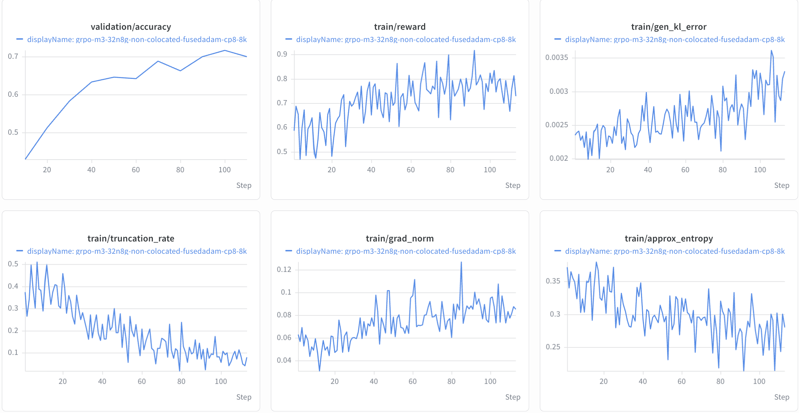

# MiniMax-M3

This guide describes GRPO training of MiniMax-M3 with the AutoModel training
backend and BF16 vLLM generation.

> [!IMPORTANT]
> **Status: Functionally Ready.** The reference recipe has been validated with
> a short non-colocated GRPO run using CP8 and EP128 on a 32-node allocation.
> Long-run convergence has not been established; see
> [Known Limitations](#known-limitations) for validation coverage.

## Support Status

| Model | Training backend | Validated training parallelism | Generation backend | Status |
| --- | --- | --- | --- | --- |
| `MiniMaxAI/MiniMax-M3` | AutoModel | CP8 + EP128 | vLLM with TP16 + EP16 | Functionally Ready |

## Validated Scope

- **Model**: `MiniMaxAI/MiniMax-M3`.
- **Algorithm**: GRPO with `DAPOMath17K` for training and
  `DAPOMathAIME2024` for validation.
- **Training backend**: AutoModel with BF16 training, activation checkpointing,
  SDPA attention, and the HybridEP expert dispatcher.
- **Training parallelism**: CP8 and EP128.
- **Generation backend**: vLLM with TP16, PP1, EP16, and BF16 weights.
- **Sequence length**: Up to 2,048 prompt tokens plus up to 6,144 response
  tokens, for a maximum total sequence length of 8,192.
- **Reference allocation**: 32 nodes with 8 GPUs per node.
- **Deployment**: Non-colocated training and generation, with 16 nodes
  allocated to vLLM generation.
- **MTP**: Disabled by setting `text_config.num_mtp_modules: 0` in the model
  configuration overrides.

Recipe YAML files under `examples/configs/recipes/` are the source of truth for
resource, parallelism, dataset, and checkpointing settings.

## How to Run

### 1. Prepare the Environment

Use the standard NeMo-RL environment described in the
[installation guide](../../../about/installation.md). MiniMax-M3 requires no
additional manual compilation or custom AutoModel and vLLM source checkouts.
For container and worker environment details, see
[Dependency Management](../../../design-docs/dependency-management.md).

The recipe uses the `MiniMaxAI/MiniMax-M3` checkpoint and the DAPO Math training
and validation datasets from Hugging Face. Set `HF_HOME` to a cache visible
from every node:

```bash
export HF_HOME=<path-to-shared-huggingface-cache>
export WANDB_API_KEY=<your-wandb-api-key>
```

The reference recipe enables W&B logging. If W&B is not configured, pass
`logger.wandb_enabled=false` when launching.

### 2. Choose the Reference Recipe

| Model | Algorithm | Backend | Scale | Recipe |
| --- | --- | --- | --- | --- |
| MiniMax-M3 | GRPO | AutoModel | 32n8g | [`grpo-minimax-m3-32n8g-automodel-cp8ep128-noncolocated.yaml`](../../../../examples/configs/recipes/llm/grpo-minimax-m3-32n8g-automodel-cp8ep128-noncolocated.yaml) |

### 3. Launch

From the repository root in a 32-node allocation with 8 GPUs per node, launch
the standard GRPO entry point:

```bash
uv run examples/run_grpo.py \
  --config examples/configs/recipes/llm/grpo-minimax-m3-32n8g-automodel-cp8ep128-noncolocated.yaml
```

See the [GRPO guide](../../grpo.md) for algorithm and common configuration
details and [Cluster Setup](../../../cluster.md) for multi-node launch setup.
Before changing the node count, review the training and generation parallel
dimensions and the separate generation allocation.

## Important Recipe Settings

- `policy.dtensor_cfg.context_parallel_size: 8` and
  `policy.dtensor_cfg.expert_parallel_size: 128` select the training layout.
- The AutoModel backend uses `attn: sdpa`, `linear: te`, and
  `dispatcher: hybridep`.
- The optimizer is Transformer Engine `FusedAdam`, with `master_weights: true`,
  `store_param_remainders: true`, and BF16 first- and second-moment states.
- `policy.offload_optimizer_for_logprob: true` enables optimizer offloading
  for log-probability computation.
- `policy.generation.colocated.enabled: false` selects non-colocated
  generation; its `resources` block allocates 16 nodes with 8 GPUs each.
- `policy.generation.vllm_kwargs.language_model_only: true` selects
  language-model-only generation. The AutoModel freeze configuration freezes
  the vision and audio towers.
- Eager execution (`enforce_eager: true`) remains part of the validated
  generation configuration. Sequence packing and dynamic batching are disabled.

## Reference Training Curves

The following curves were produced with the reference CP8/EP128 configuration
on the 32-node allocation described above. They show validation accuracy,
training reward, generation KL error, truncation rate, gradient norm, and
approximate entropy. Validation accuracy reaches approximately 0.72 at step 100.



## Known Limitations

- **Sequence length**: The validated configuration uses CP8 and EP128 with an
  8,192-token maximum total sequence length. Longer sequences have not been
  validated.
- **Additional parallelism**: Training with PP, TP, and sequence packing is not
  part of the validated MiniMax-M3 training scope yet.
- MTP is disabled in the reference configuration.
- Long-run convergence has not been established for this recipe.
